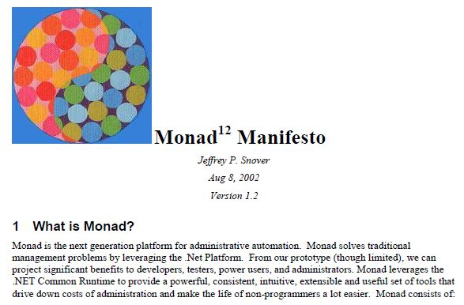
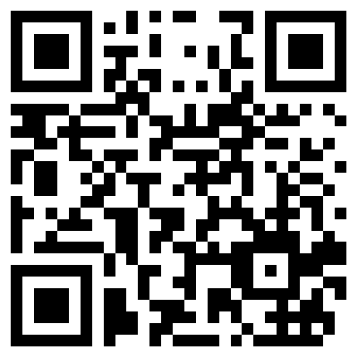

## Welcome to Monad Club

Marcin Malinowski

- Twitter: [@orientman](https://twitter.com/orientman)
- GitHub: https://github.com/orient-man
- Blog: https://orientman.wordpress.com/

---

## Abstrakt

Pierwsza zasada klubu - monad się nie tłumaczy.

Druga zasada...

Zatem zamiast tłumaczyć, będziemy obserwować je w naturze (językach C# i F#).

---

## O mnie

- Tata^2, mąż humanistki, mól książkowy, uparciuch, programista, konferencjoholik.  Don Kichot walczący z entropią. Kocha sprzeczności i humor. Wierzy w przypadek. Piwny filozof. W nielicznych wolnych chwilach harata w gałę (na bramce).

- Basic, Turbo Pascal/C, Assembler, Clipper, MS Access, Visual Basic, Java-XML :), C++, C#, JavaScript, F#...  i ze wszystkiego miałem frajdę, ale nie za wszystkim tęsknię.

- Absolwent informatyki i matematyki na UW. Ekspert IT w mBanku.

***

## Wstęp


***

## Co z tymi monadami?


***

### Straszno...

<!-- .slide: data-background="./images/skull.png" -->

> "Monady to byty duchowe nie mające charakteru czasowego ani przestrzennego"

> Gottfried Wilhelm Leibniz

Note:
 - zapytajmy eksperta

***

### ...i śmieszno


> Monadic awareness is awakened through specific meditation practices.

Zródło: http://www.energyreality.com/pgs/mona.htm

***

<!-- .slide: style="top: -100px !important;" -->


***

<!-- .slide: style="top: -100px !important;" -->


***

### Tako rzecze źródło wszelkiej wiedzy

"Monada jest rodzajem <font color="#fa0">konstruktora abstrakcyjnego typu danych</font> [...] Monady pozwalają programiście <font color="#fa0">sprzęgać ze sobą kolejno wykonywane działania</font> i budować potoki danych, w których każda akcja jest materializacją wzorca <font color="#fa0">dekoratora z dodatkowymi regułami przetwarzającymi</font>.

Formalnie monadę tworzy się definiując dwie operacje – wiązanie (ang. <font color="#fa0">bind</font>) i powrót (ang. <font color="#fa0">return</font>) [...]"

http://pl.wikipedia.org/wiki/Monada_%28programowanie%29

---

<!-- .slide: data-transition="convex" -->


***

## Kod, kod, kod...

Note:
 - option - OptionBuilder - ROP - task - AsyncBuilder

---


---

``async`` jest instancją klasy ``AsyncBuilder``:

```fsharp
type AsyncBuilder =
    class
        new AsyncBuilder : unit -> AsyncBuilder
        member this.Bind : Async<'T> * ('T -> Async<'U>) -> Async<'U>
        member this.Combine : Async<unit> * Async<'T> -> Async<'T>
        member this.Delay : (unit -> Async<'T>) -> Async<'T>
        member this.For : seq<'T> * ('T -> Async<unit>) -> Async<unit>
        member this.Return : 'T -> Async<'T>
        member this.ReturnFrom : Async<'T> -> Async<'T>
        member this.TryFinally : Async<'T> * (unit -> unit) -> Async<'T>
        member this.TryWith : Async<'T> * (exn -> Async<'T>) -> Async<'T>
        member this.Using : 'T * ('T -> Async<'U>) -> Async<'U>
        member this.While : (unit -> bool) * Async<unit> -> Async<unit>
        member this.Zero : unit -> Async<unit>
    end
```

<!-- .element: class="fragment" -->
Na szczęście, aby używać LINQ-a nie musimy znać w każdym szczególe implementacji _LINQ Providera_ - to samo dotyczy _async_ i innych workflowów w F#.

***

### Przykłady typów monadycznych w C# ###

- ``Nullable<T>``
- ``Func<T>``
- ``Lazy<T>``
- ``Task<T>``
- ``IEnumerable<T>``

Note: także generatory

---

### Podsumownie Monad w C# ###

- LINQ jest zaprojektowany do zapytań (zaskoczenie :)
    - Brak instrukcji sterujących: if/then/else, pętli etc.
- Brak uniwersalnego wsparcia dla typu "monadycznego" na poziomie języka np.: _notacja do_ w Haskellu, _computational expressions_ w F#
- Stąd część użytecznych monad zostala wbudowana w język

<!-- .element: class="fragment" -->
...ale to nie znaczy, że nie możemy stworzyć naprawdę użytecznych monad w C#!

---

### Przykład: Parser monadyczny

- https://github.com/sprache/Sprache
- C# Functional Language Extensions: https://github.com/louthy/language-ext

***

### Monady są wszędzie



---

<!-- .slide: data-background="./images/wordle.png" style="top: -50px !important;" -->

### Morał: Najpierw konkret potem abstrakcja

Note:

Programmable semicolons:5
AOP:3
Burritos:1
Container Types:1
Elephant in the room:3
Higher order functions:2
Chain operations:3
Pipelines:2
Decorators:3
Assembly lines:1
DSL:2
Functors:1
Amplified types:1
Wrappers around function invocation:1
Function generators:4
Programming structure that represents computations:1
Composable computation descriptions:1

https://www.jasondavies.com/wordcloud/

***

## Bibliografia

- Książka: [Real-World Functional Programming - Petricek & Skeet](http://www.amazon.com/Real-World-Functional-Programming-With-Examples/dp/1933988924) - [rozdział 12](http://www.manning.com/petricek/SampleChapter12.pdf)
- Video: [Mike Hadlow on Monads](http://vimeo.com/21705972) - prościej się nie da?
- Video: [Scott Wlaschin - Railway Oriented Programming -- error handling in functional languages](http://vimeo.com/97344498)
- Video: [Scott Wlaschin - Coding Like Frankenstein](https://vimeo.com/142347199) - i pozamiatane!
- Video: [Greg Meredith - Monadic Design Patterns for the Web - Introduction to Monads](http://channel9.msdn.com/Series/C9-Lectures-Greg-Meredith-Monadic-Design-Patterns-for-the-Web/C9-Lectures-Greg-Meredith-Monadic-Design-Patterns-for-the-Web-Introduction-to-Monads) - abstrakcyjnie, ale zjadliwie
- Blog: [Fabulous adventures in coding: Monads, parts 1-13](http://ericlippert.com/category/monads/) - wyczerpująco
- Ciekawostka: [Monad/PowerShell Manifesto](http://www.jsnover.com/Docs/MonadManifesto.pdf)

***

## Aaa... pytania?

Ankieta: https://www.surveymonkey.com/r/G2FW295 Pls!



- Slajdy: http://orient-man.github.io/kgdnet97/
- Źródłowce: https://github.com/orient-man/MonadClub

Note:

http://goqr.me/

